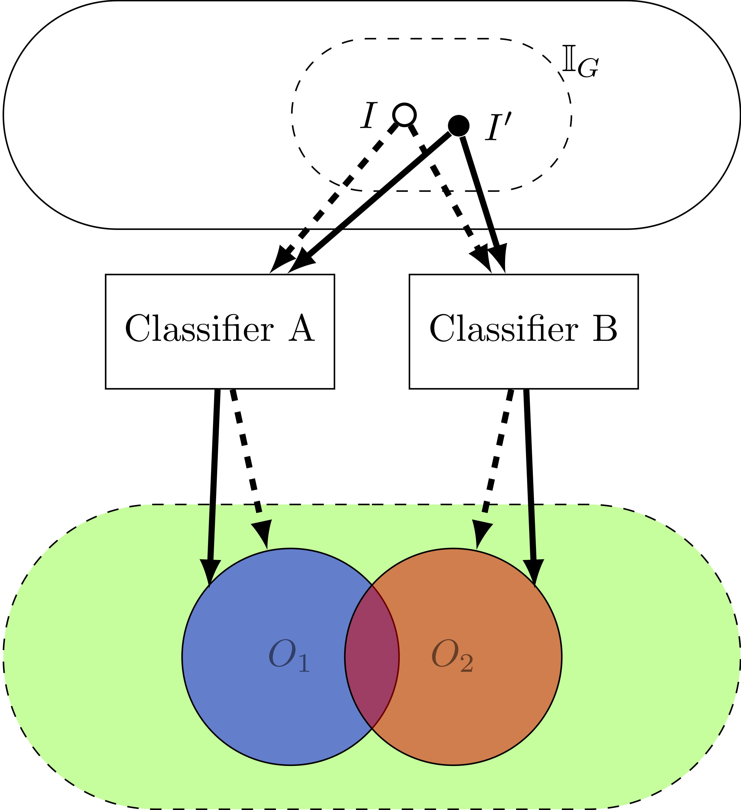

# Ogma

We present Ogma, the first approach, which provides a systematic test framework for machine-learning systems that accepts grammar-based inputs.
See the paper [Grammar Based Directed Testing of Machine Learning Systems](https://arxiv.org/pdf/1902.10027) for more details



## Prerequisites

* Python 2.7.15
* numpy 1.14.5
* scipy 1.1.0
* scikit-learn 1.19.0

The authors used Pycharm CE 2017.2.3 as the development IDE.

## Background

The Ogma approach is encapsulated in GramFuzz*.py. 
To run these files, you'll need a Context Free Grammar, a Jaccard Threshold and an API for your NLP service. 
You can look at the sample APIs in aylien_API.py, rosette_API.py and uclassify_API.py. 
Please run these with an example to see the type of inputs required of the output. 

## Organization 

### APIs
This folder consists of the APIs of the software used in the evaluationg of Ogma. 
We have specifically written the APIs such that the output of the `get_label` function 
for `aylien_API.py`, `rosette_API.py`, `textrazor_API.py` and `uclassify_API.py`
are standard. 

Please create a file called `API_KEYS.py` and add your keys in the folowing format:

```
TEXTRAZOR_API_KEY = "<insert key here>"
UCLASSIFY_API_KEY_READ = "<insert key here>"
UCLASSIFY_API_KEY_WRITE = "<insert key here>"
AYLIEN_KEY = "<insert key here>"
AYLIEN_APP_ID = "<insert key here>"
ROSETTE_API_KEY = "<insert key here>"
```

### Data Plotting Scripts
This folder consists of scripts to reproduce the figures seen in the 
appendix of the [paper](https://arxiv.org/pdf/1902.10027). 

There are two scripts in the folder, namely `PlotData.py` and `PlotTime.py`. 
These will consolidate the data into image form in the `Plots` folder. The 
`PlotData.py` script will plot the number of errors and the `PlotTime.py` 
script will plot the time taken. 

## Demo
`python <filename>`

eg. `python GramFuzz_Rosette_uClassify.py`

## Contact
* Please contact sakshi_udeshi@mymail.sutd.edu.sg for any comments/questions
